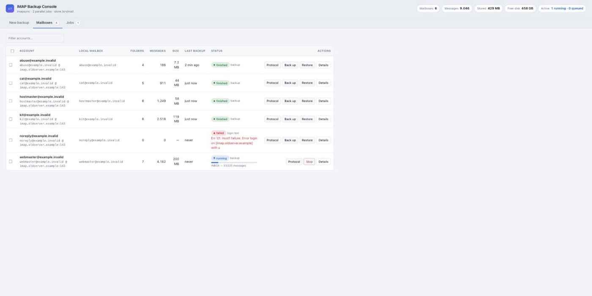
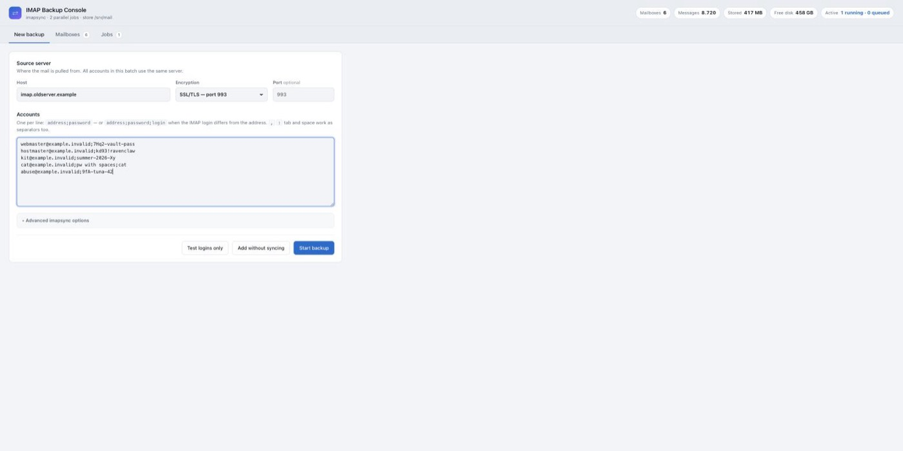
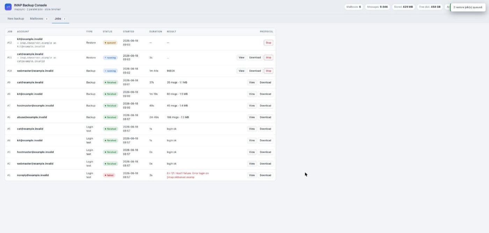
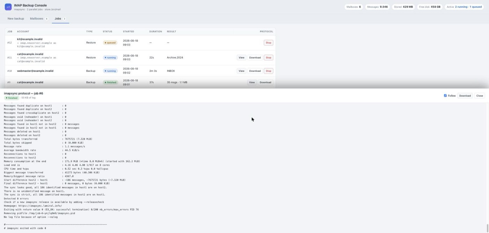
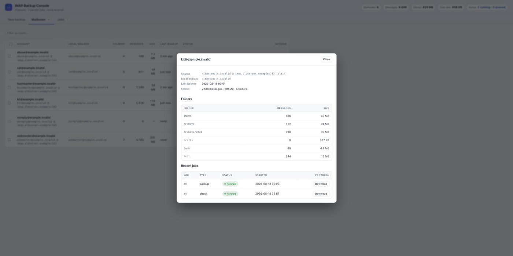
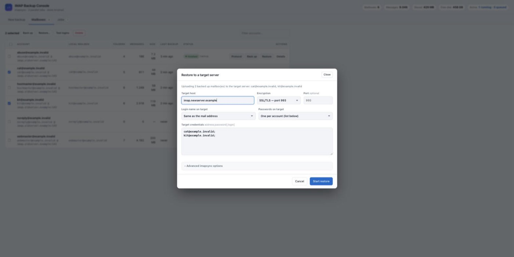

# IMAP Backup Console

Self-hosted web console for migrating IMAP mailboxes between servers. Pull any
number of accounts off an old server onto local disk with
[imapsync](https://imapsync.lamiral.info/), watch every sync live, keep the
imapsync protocol of each run, and push the mailboxes onto the new server when
you are ready.

Everything ships as two Docker containers — no imapsync, Perl or Dovecot
installation on the host, and nothing that depends on macOS packages.



```
                    ┌──────────────────────── docker compose ────────────────────────┐
                    │                                                                │
  source IMAP  ───► │  app        FastAPI + web UI + imapsync   ───►  dovecot        │ ───►  target IMAP
  (old server)      │  ./data/app  jobs, logs, credentials           ./data/mail     │       (new server)
                    │                                            Maildir per account │
                    └────────────────────────────────────────────────────────────────┘
                          backup:  source ──► local store          restore: local store ──► target
```

The bundled Dovecot **is** the backup store. Every account gets its own Maildir
under `./data/mail/<account>/Maildir` — ordinary files you can copy, archive or
`rsync` to another machine at any time. imapsync always talks IMAP on both
sides, which is what makes the same tool work for downloading *and* uploading.

## Why a local staging store

Most migration tools copy straight from the old server to the new one, so both
have to exist at the same moment and you are left with nothing afterwards. Here
the mail lands on your disk first. You can drain the old server today, hand the
hosting back, and load the new server next week — and every run leaves a full
imapsync protocol you can hand to a client who asks whether their 2019 mail
survived.

If both servers are live and you only need a one-off copy, plain `imapsync` in
a loop is less work. This is for repeat migrations and for the cases where the
two ends do not overlap in time.

## Features

- **Bulk credential entry** — paste `address;password` per line plus one source
  server for the whole batch
- **Job queue** with a configurable number of parallel imapsync processes
- **Live status** per account: queued → running (current folder, messages
  remaining, progress bar) → finished / failed
- **The full imapsync protocol** for every run: tail it in the browser while it
  is still being written, download it as a `.log` when the job is done
- **Mailbox overview** — folder count, message count and size on disk per
  account, with a per-folder breakdown
- **Restore** one or many mailboxes onto a target server, target credentials
  entered at restore time (one password for all, or one per account)
- **Login test** (`imapsync --justlogin`) and **dry run** before touching mail
- **Incremental** — re-running a job only transfers what is missing on the
  other side, so interruptions are harmless
- Mailbox passwords encrypted at rest, HTTP basic auth in front of the UI

## Quick start

```bash
cp .env.example .env

openssl rand -hex 20      # -> DOVECOT_MASTER_PASSWORD
openssl rand -hex 32      # -> SECRET_KEY
                          # -> AUTH_PASSWORD: pick your own

docker compose up -d --build
open http://127.0.0.1:8080          # or whatever WEB_PORT you set
```

Log in with `AUTH_USER` / `AUTH_PASSWORD`. The console binds to `127.0.0.1`
only — see [Security](#security) before you change that.

`DOVECOT_MASTER_PASSWORD` guards the internal backup store. It is never
published outside the compose network, but it must be set and may only contain
`A-Z a-z 0-9 . _ ~ = + / @ : -` — Dovecot config values cannot hold spaces,
quotes or `#`.

## Migrating a server, step by step

### 1 — Collect the accounts

On *New backup*, enter the old server, pick the encryption (SSL/TLS 993,
STARTTLS 143 or none) and paste the mailboxes:



```
anna@example.com;S3cret!
ben@example.com;hunter2
info@example.com;pw with spaces;info      # 3rd field = IMAP login name
```

The **first** separator on a line splits address from password, so `;` `,` `:`
tab and space all work and the password may contain any of the others. Lines
starting with `#` are ignored.

### 2 — Verify the credentials

*Test logins only* runs `imapsync --justlogin` for each account and reports
exactly what the server said — much faster than discovering a typo halfway
through a 3 GB download. Fix any line and paste it again; existing accounts are
updated, not duplicated.

### 3 — Download

*Start backup* queues one job per account, `MAX_CONCURRENT_JOBS` of them run at
a time. The *Jobs* tab is the full history — backups, restores and login tests
with duration, result and protocol:



Jobs can be stopped at any point and started again later — imapsync picks up
where it left off.

### 4 — Check what you got

`Protocol` shows the imapsync output, live while the job runs and as a
downloadable `.log` afterwards, ending in the statistics block:



`Details` breaks a mailbox down by folder, so you can confirm that Sent,
Archive and friends really arrived:



### 5 — Upload to the new server

Select the mailboxes, press *Restore…*, enter the target host and the target
credentials. The login name on the target can be the mail address, the source
login, or a third field in the credential list:



Run it as a *Dry run* first if you want to see the plan without writing.

### 6 — Verify and repeat

Restores are incremental too: run the backup again after the DNS switch to
catch mail that arrived in the meantime, then restore again — only the new
messages move.

## Where the data lives

| Path | Content |
| --- | --- |
| `./data/mail/<account>/Maildir` | the downloaded mail, one Maildir per account |
| `./data/app/imapbackup.db` | accounts, jobs, statistics (SQLite) |
| `./data/app/logs/job-000012-backup.log` | one imapsync protocol per job |
| `./data/app/secret.key` | only when `SECRET_KEY` is left empty |

To move the whole console to another machine, copy the project directory
including `data/` and `.env`, then `docker compose up -d`. To hand over just
the mail, copy `./data/mail`.

## Configuration

All settings live in `.env`:

| Variable | Default | Meaning |
| --- | --- | --- |
| `DOVECOT_MASTER_PASSWORD` | — | required, guards the internal store |
| `SECRET_KEY` | auto | encrypts stored mailbox passwords |
| `AUTH_USER` / `AUTH_PASSWORD` | `admin` / — | HTTP basic auth; empty user disables it |
| `WEB_PORT` | `8080` | host port of the web interface |
| `WEB_BIND` | `127.0.0.1` | address the port is bound to |
| `MAX_CONCURRENT_JOBS` | `2` | parallel imapsync processes |
| `ALLOW_EXTRA_ARGS` | `1` | set to `0` to remove the free-form imapsync argument field |
| `IMAP_TIMEOUT` | `180` | IMAP socket timeout in seconds |
| `VMAIL_UID` / `VMAIL_GID` | `1000` | owner of the mail files on the host |
| `TZ` | `UTC` | timezone for timestamps |
| `IMAPSYNC_VERSION` | `imapsync-2.314` | pinned imapsync release tag |

Changing `SECRET_KEY` after accounts exist makes their stored passwords
undecryptable — re-import those accounts to fix it.

## Advanced imapsync options

Both the backup form and the restore dialog have an *Advanced* section:

| Field | imapsync flag | Example |
| --- | --- | --- |
| Exclude folders | `--exclude` (one regex per line) | `^\[Gmail\]/All Mail$` |
| Only these folders | `--folder` (exact names) | `INBOX` |
| Extra arguments | appended verbatim | `--maxage 3650 --skipcrossduplicates` |
| Automap special folders | `--automap` (on by default) | maps Sent/Drafts/Trash across naming schemes |
| Accept invalid certificates | `--sslargs1/2 SSL_verify_mode=0` | self-signed servers |
| Dry run | `--dry` | report only, write nothing |

## Provider notes

- **Strato** — `imap.strato.de`, SSL/TLS on 993, the login name is the full
  mail address.
- **Gmail / Google Workspace** — IMAP must be enabled and you need an app
  password. Exclude `^\[Gmail\]/All Mail$` unless you want every message a
  second time.
- **Outlook / Microsoft 365** — modern authentication may block plain IMAP
  logins entirely; check the tenant settings before planning a migration.
- **Self-signed certificates** — tick *Accept invalid certificates* rather than
  falling back to an unencrypted connection.

## Security

This box ends up holding every migrated mailbox's password **and** a full copy
of its mail. Treat it as a crown-jewel host and keep it off the public
internet.

**Anyone who can reach the console can read and move every mailbox it stores.**
There is one admin account, no roles, and a restore can push any stored mailbox
to any server the operator names. Authentication is the whole boundary.

- **Binding.** The compose file publishes on `127.0.0.1` only. Setting
  `WEB_BIND=0.0.0.0` puts basic auth over plain HTTP on the network — do that
  only behind a TLS reverse proxy. There is no rate limiting on the login.
- **Extra arguments are remote code execution, by design.** The field is passed
  to imapsync verbatim, and imapsync can run shell commands (`--pipemess`),
  evaluate Perl (`--regexmess`, `--regextrans2`) and delete mail on the *source*
  server (`--delete1`). Set `ALLOW_EXTRA_ARGS=0` for anything that is not a
  strictly single-admin deployment; the field is then rejected and disabled in
  the UI.
- **Stored passwords are obfuscated, not protected.** They are Fernet-encrypted
  with `SECRET_KEY`, but when that is left empty the key is generated next to
  the database in `./data/app/secret.key`. Anyone with the disk has the
  passwords. Keep `SECRET_KEY` outside the data directory if that matters.
- **Cross-site requests are blocked.** Every state-changing request needs
  either a same-origin `Sec-Fetch-Site` or the header
  `X-Requested-With: imapbackup`, so a page you visit elsewhere cannot drive
  the console through your logged-in browser.
- **Passwords never reach the process list or a protocol file.** imapsync gets
  them through `--passfile1/2` with `0600` permissions in a per-job temp
  directory that is removed when the job ends.
- **The internal Dovecot** accepts any username with the shared
  `DOVECOT_MASTER_PASSWORD` over an unencrypted connection. That is fine
  because it is not published — but every container on the same compose network
  can reach it, so do not attach unrelated services to it.

## Notes and caveats

- **Folder separator.** The backup store uses the classic Maildir++ layout, in
  which `.` separates folder levels. A source folder whose *name* contains a
  dot (`Invoices 2024.old`) therefore arrives as a nested folder. Use
  `--regextrans2` in the extra arguments if that matters for your migration.
- **Restarts.** Jobs still running when the service stops are marked as
  interrupted; start them again and imapsync continues where it left off.
  Queued jobs are picked up automatically after a restart.
- **Disk.** Mail is stored uncompressed, one file per message — plan for
  roughly the size the old server reports, and keep an eye on the *Free disk*
  chip in the header.

## Trying it without real mailboxes

```bash
./test/smoke-test.sh          # two throwaway IMAP servers, source pre-filled
./test/smoke-test.sh clean    # remove them again
```

The script prints the host names and credentials to paste into the UI:
`imap-test-source` (encryption *None*, port 143) holds four demo accounts with
mail in INBOX, Sent, Archive and Archive/2024; `imap-test-target` starts empty
and serves as the restore target.

## HTTP API

The UI is a thin layer over a REST API — interactive docs at `/api/docs`.
Requests that change something must carry `X-Requested-With: imapbackup`
(browsers on the same origin are accepted without it):

```bash
curl -u admin:$AUTH_PASSWORD -X POST http://127.0.0.1:8080/api/jobs \
  -H 'Content-Type: application/json' -H 'X-Requested-With: imapbackup' \
  -d '{"account_ids":[1,2],"kind":"backup","options":{"automap":true}}'
```

| Method | Path | Purpose |
| --- | --- | --- |
| `GET` | `/api/state` | accounts, jobs, counters — everything the UI polls |
| `POST` | `/api/accounts/bulk` | import credentials, optionally start jobs |
| `POST` | `/api/jobs` | start backup / login test for account ids |
| `POST` | `/api/restore` | start restore jobs |
| `GET` | `/api/jobs/{id}` | job status, progress and final statistics |
| `GET` | `/api/jobs/{id}/log?offset=` | incremental protocol tail |
| `GET` | `/api/jobs/{id}/log/download` | protocol as a file |
| `POST` | `/api/jobs/{id}/cancel` | stop a queued or running job |
| `GET` | `/api/accounts/{id}` | mailbox detail incl. per-folder sizes |
| `POST` | `/api/accounts/{id}/rescan` | recount messages and size on disk |
| `DELETE` | `/api/accounts/{id}?purge=true` | remove account (and its mail) |

## Project layout

```
app/
  Dockerfile              python:3.12-slim + imapsync + its Perl dependencies
  imapbackup/
    main.py               FastAPI routes, auth, CSRF guard, serialization
    runner.py             job queue, imapsync process handling, cancellation
    parsing.py            credential input + imapsync output parsing
    mailstore.py          Maildir inspection (folders, messages, size)
    db.py, crypto.py      SQLite access, password encryption
    static/               the single page UI (no build step)
dovecot/                  the local backup store (Dovecot 2.3, Maildir++)
test/smoke-test.sh        disposable source/target servers with demo mail
docker-compose.yml        both services, bind mounts, health checks
```

## License

MIT — see [LICENSE](LICENSE). imapsync itself is published by Gilles Lamiral
under the *NO LIMIT PUBLIC LICENSE* and is downloaded at image build time, not
vendored here.
